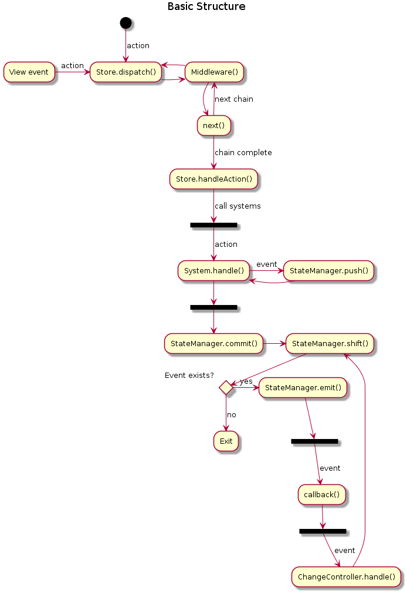

# Ecsalator
An action based Entity-Component-System library

This is currently in development, everything can be changed!

# Why?

Entity-Component-System is good to use in games, however it's kinda awkward to
use it in turn-based games, or multiplayer games.

I've been thinking that a turn-based game can be considered as a thin client
and a server, like web applications. Web applications, primarily
single paged applications (SPA), send HTTP requests to retrieve information
or run a command on a remote server. Those HTTP requests have 'method'.
For example, 'GET' requests are used to retrieve missing information from the
server, and 'POST' requests are used to change information of the server.

We can simply implement actions to ECS pattern by just directly manipulating
game state. However, systems won't get called if we just do that - we have to
call systems after running an action. My previous ECS library,
[ecstasy](http://github.com/yoo2001818/ecstasy)
did that. However this approach gives dirty code, action code and
initialization, update, pre-action, post-action code all cluttered everywhere.

I saw React and Redux, and that gave me this idea: Process everything as an
action. update, initialization, etc... Every action goes through middlewares
and systems. This would greatly simplify the logic - at least code won't be
cluttered.

How about multiplayer games? Multiplayer games need validation from the server.
Some actions may skip validation to make the game faster, but some important
actions should require validation. By intercepting the dispatch function, we
can interrupt the action flow, send them to the server, and receive the
response and dispatch to the action flow. Middlewares are used to do that -
it's exactly same as Redux's design.

To synchronize the game state between the server and the client,
systems shouldn't mutate the action, and any other thing except than systems
shouldn't mutate the game state. Additionally, systems should be deterministic
in order to have synchronized game state - It shouldn't be random. Instead,
server's middleware should inject random values to the action.

In 'traditional' ECS design, a 'Rendering System' would handle rendering the
game state to the canvas. However, in turn-based games, or web applications
which directly handles DOM, this is really awful. Drawing everything again
even if it isn't needed (and DOM is slow). For DOM, you can React to speed it
up (Virtual DOM to the rescue). However this doesn't actually solve
architectural problems. Instead of comparing everything again, we can just
emit events when a entity is changed. Then, the renderer can simply redraw
changed nodes.

There would be two kind of events. Component event and entity event.
Component event is bound to specific component. If any entity's specific
component is changed, component event will be emitted. Entity event, however,
is bound to specific entity. This is reverse of component event, and it will
be emitted if specific entity's components are changed.

Some games may need indexing to improve the speed. For example, collision check
would be faster if we can index the entities to quad tree, R-tree, etc.
Otherwise the game would require O(n^2) to do a collision check.
By emitting an event after entity modification, we can do that. However, since
systems are only bound to mutate entities when an action has arrived, this
can't be called as a system. Since it handles indexing, rendering, or anything
else after the event, I'd call it a handler.

After combining everything in order, we can get a structure diagram like this.

1. View, or something else (Polling event, user interaction, timer, etc...)
   creates an action and dispatches it to the Engine.
2. Engine would pass it to the middleware chain.
3. Middleware can dispatch another action, pass the action to next middleware,
   or simply reject it. It is used to inject required information, or request
   something from the remote, etc.
4. System receives the action and edit the entity.
5. Entity emits an event to Handler.
6. Handler may dispatch an action again, or update the View, or refresh the
   indexing, etc.
